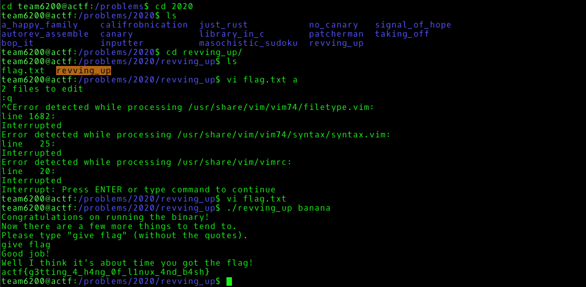

# Revving Rev

### How to get the flag?
* $ ssh team6200@shell.actf.co
* $ cd /problems/2020/revving_up
* $ ./revving_up banana
    ```
    Congratulations on running the binary!
    Now there are a few more things to tend to.
    Please type "give flag" (without the quotes).
    give flag
    Good job!
    Well I think it's about time you got the flag!
    actf{g3tting_4_h4ng_0f_l1nux_4nd_b4sh}
    ```
    